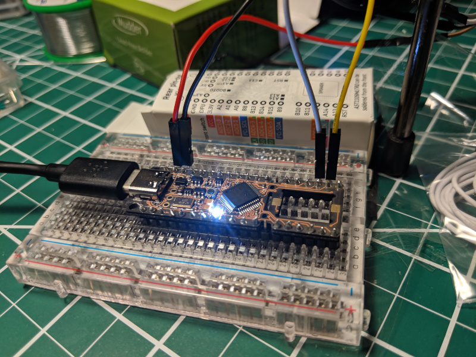

# proton-c

Board Support Crate for the [Proton C][].

[Proton C]: https://qmk.fm/proton-c/




## Hardware Setup

Beyond the Proton C itself, it is highly recommended to setup a an ST-Link
hardware debugger. It is also recommend to solder on header pins to hook up the
ST-Link via a bread board. A soldering iron and solder may be needed to attach
the header pins.

### Hardware List

*   USB-C to USB-Whatever-Connects-to-the-Computer cable (one capable of data
    transfer, required)

*   ST-Link Debugger (recommended)

*   Female to female breadboard jumper cable wires (usually comes with the
    ST-Link itself, recommended)

*   Breadboard (recommended)

*   2.54mm straight single row pin header strips (recommended)

*   Male to male breadboard jumper cable wires (recommended)

### Hooking up the ST-Link

After the header pins are soldered up and the Proton C is attached to a
breadboard, the ST-Link needs to be connected to the relevant debugging ports.
Connect the following ports on the ST-Link to the ports on the Proton C:

*   SWDIO: A13
*   SWCLK: A14
*   GND: GND
*   5V: 5V

### Connecting the Proton C to the Computer

Connect the USB from the ST-Link and the cable connected to the USB-C port of
the Proton C to the computer&mdash;both are needed.

## Software Setup

It should go without saying that Rust Nightly and Cargo are needed. To build,
flash, and run a few other things need to be installed.

### Rust Platform Target

To build for the Pronton C, the `thumbv7em-none-eabihf` target is needed. You
can install it running the following:

```bash
rustup target add thumbv7em-none-eabihf
```

### Other Dependencies

To flash and debug through the ST-Link, the following are needed:

*   `openocd`
*   `gdb-multiarch`

For operating systems other than Ubuntu / Debian-based distros, these may be
installed under different names.

## Running

The setup to build, flash, debug, and reset needs 3 different terminals:

1.  1 terminal to run the OpenOCD server
2.  1 terminal to build, flash, and run debugging using GDB
3.  1 terminal to reset the Proton C after flashing

### Running the OpenOCD Server

To run the server with correct configuration change directory to where this
repo is located, then run:

```bash
openocd
```

This server will be used by the other terminals to interact and send commands to
the Proton C.

### Building, Flashing, and Debugging

Cargo is configured to build, flash, and start debugging in this repo, simply
run:

```bash
cargo run
```

...and everything will get started. Once this is completed you will need to
reset the Proton C, see instructions on resetting below. To stop debugging,
enter the command: `quit`.

### Resetting

After a program has been flashed to the Proton C, it needs to be reset. This can
normally be done by unplugging any power sources and power cycling the Proton C,
but to make life easier you can use the ST-Link and OpenOCD to instruct the
Proton C to reset.

1.  Connect to the OpenOCD server:

    ```bash
    telnet localhost 4444
    ```

2.  Reset whenever needed:

    ```bash
    reset run
    ```
